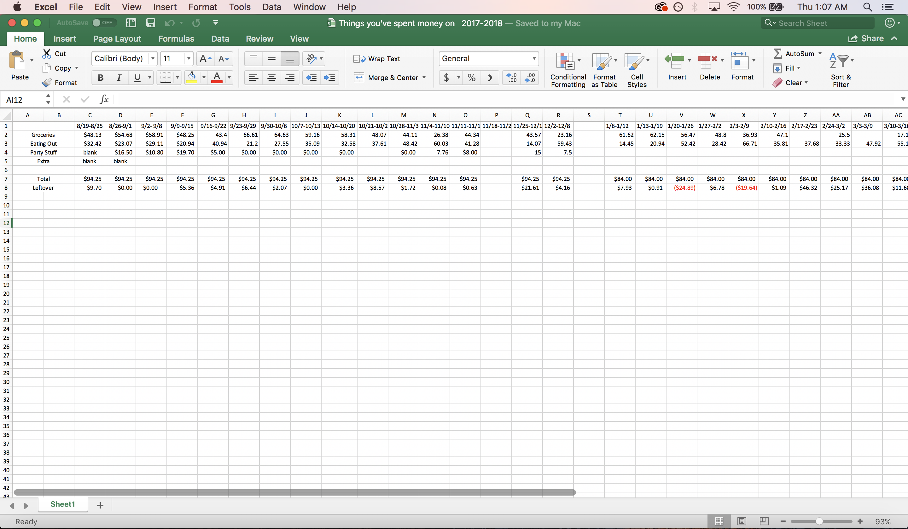
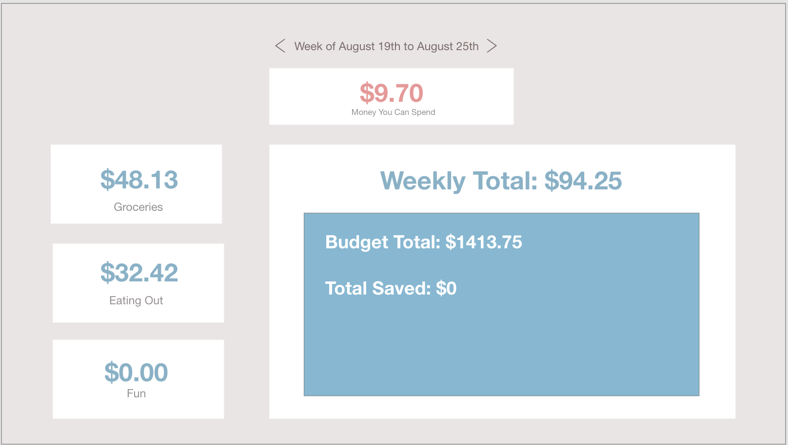

# personal-budgeting-app

I've been managing my money in college through an excel sheet 
(like this)

and wanted to create a web app that was more user friendly and efficient for my budgeting.
(like this mock up I made)

Started out coding this in vanilla js but after seem research Im currently learning how to use React.js to create this app so its easier to manage complexity. 
